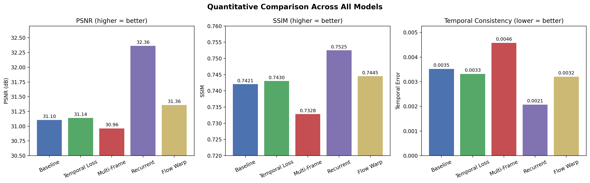
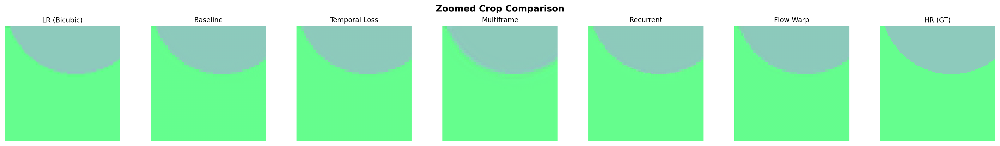
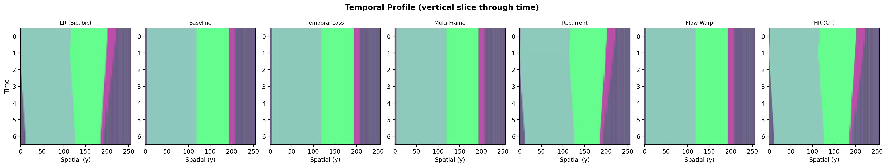

# Video Super-Resolution with Temporal Consistency

> Built with assistance from Claude Code. All code, results, and writing in this repository were reviewed and verified by hand before publication.

**6.S058 Final Project.** A baseline single-frame SR model and four temporal approaches, compared on 2x upscaling for PSNR, SSIM, and frame-to-frame temporal error.

## Results

| Model | Params | PSNR (dB) ↑ | SSIM ↑ | Temporal Error ↓ |
|-------|-------:|------------:|-------:|-----------------:|
| Baseline (ESPCN) | 27K | 31.10 ± 0.63 | 0.7421 | 0.0035 |
| Temporal Loss | 27K | 31.14 ± 0.62 | 0.7430 | 0.0033 |
| Multi-Frame | 73K | 30.96 ± 0.64 | 0.7328 | 0.0046 |
| **Recurrent (ConvLSTM)** | **175K** | **32.36 ± 0.52** | **0.7525** | **0.0021** |
| Flow Warp | 181K | 31.36 ± 0.57 | 0.7445 | 0.0032 |






## Reproducing the experiments

End-to-end run from a fresh clone takes roughly an hour on an Apple M4 (10-core GPU, 16GB) using synthetic data.

```bash
# 1. Install
pip install -r requirements.txt

# 2. Generate the synthetic dataset (~1.3GB, ~2 min)
python scripts/generate_synthetic.py --n-train 1500 --n-test 300

# 3. Train all five models (writes checkpoints/<model>/best.pt)
for cfg in configs/*.yaml; do
  python src/train.py --config "$cfg"
done

# 4. Evaluate each model (writes results/<model>/metrics.json + per-sequence outputs)
for cfg in configs/*.yaml; do
  name=$(basename "$cfg" .yaml)
  PYTORCH_ENABLE_MPS_FALLBACK=1 python src/evaluate.py \
    --config "$cfg" \
    --checkpoint "checkpoints/$name/best.pt" \
    --max-videos 5
done

# 5. Build the four summary figures in results/
PYTORCH_ENABLE_MPS_FALLBACK=1 python scripts/generate_comparisons.py
python scripts/replot_metrics.py
```

To use the full Vimeo-90K dataset (~82GB) instead of synthetic, run `bash scripts/download_data.sh` in step 2. The directory layout matches, so the rest of the pipeline is unchanged.

`PYTORCH_ENABLE_MPS_FALLBACK=1` is needed for the flow warp model on Apple Silicon (`grid_sampler_2d_backward` is not implemented on MPS).

## Models

All under `src/models/`. Picked up by name from each YAML config.

1. **Baseline** (`baseline.py`). ESPCN with sub-pixel convolution ([Shi et al. 2016](https://arxiv.org/abs/1609.05158)). Per-frame, no temporal awareness.
2. **Temporal Loss** (`temporal_loss.py`). Same ESPCN, trained with `L_pixel + λ * || (SR_t − SR_{t−1}) − (HR_t − HR_{t−1}) ||₁`.
3. **Multi-Frame** (`multiframe.py`). 3 consecutive LR frames concatenated as 9 input channels, outputs the SR center frame.
4. **Recurrent** (`recurrent.py`). ConvLSTM cell carrying state across 7-frame sequences, trained with BPTT.
5. **Flow Warp** (`flow_warp.py`). Lightweight flow net warps neighbors to the center frame, fuses, then upscales.

## Layout

```
configs/        # one YAML per model (data, model, loss, training)
src/            # train.py, evaluate.py, data.py, losses.py, models/
scripts/        # generate_synthetic.py, download_data.sh, generate_comparisons.py, replot_metrics.py
results/        # metrics.json + summary figures (per-sequence outputs gitignored)
checkpoints/    # gitignored, populated by training
data/           # gitignored, populated by step 2
```

## Metrics

- **PSNR** — `10 * log10(1 / MSE)` on RGB frames in `[0, 1]`.
- **SSIM** — [Wang et al. 2004](https://ieeexplore.ieee.org/document/1284395), computed per frame and averaged.
- **Temporal Error** — `mean || (SR_t − SR_{t−1}) − (HR_t − HR_{t−1}) ||₁` across the test sequences.
